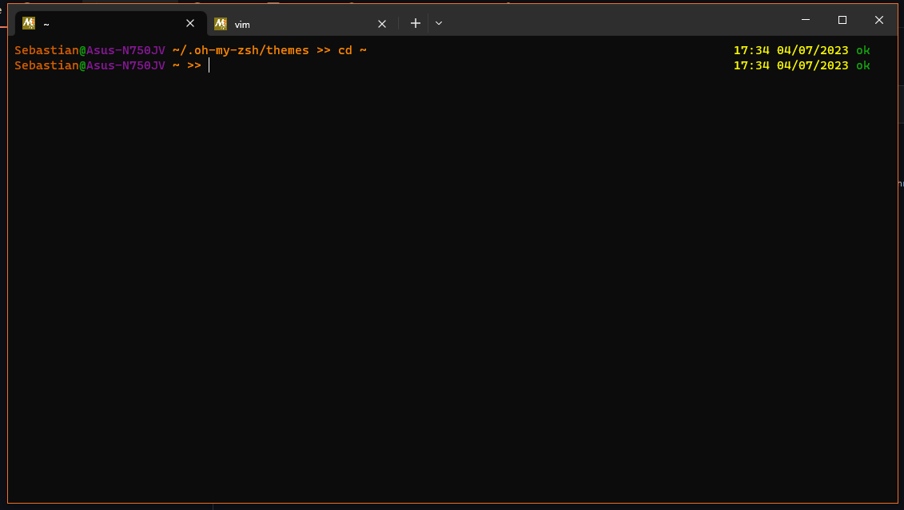

# Warm-Colours
A zsh theme

## Getting started
Download the `warm-colours.zsh-theme` file and put in in the `~/.oh-my-zsh/themes` folder. After that, open `.~/zshrc` file in a text editor and set `ZSH_THEME = warm-colours`
